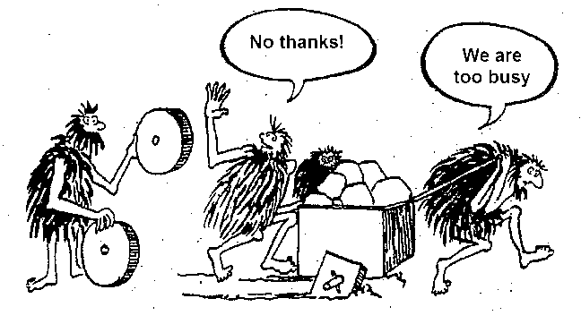
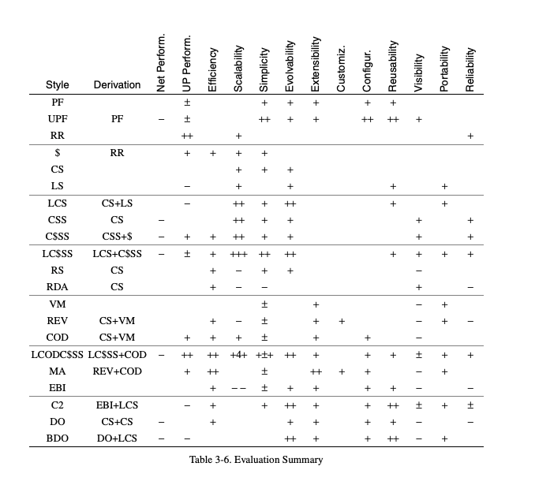

# Architectural Styles and the Design of Network-based Software Architectures - Roy Fielding

**Group members:**  
Rasmus Helsgaun,
Adam Lass,
Stephan Djurhuus &
Pernille Lørup

_In year 2000, the software engineer and researcher Roy Fielding (https://roy.gbiv.com/) published his PhD thesis (https://www.ics.uci.edu/~fielding/pubs/dissertation/top.htm), entitled Architectural Styles and the Design of Network-based Software Architectures, in which he introduced and defined the concept behind the now so popular abbreviation REST._

**1. What exactly is REST? How does the context of it fits to the title of the dissertation?**
 Representational State Transfer (REST) is an architectural style for distributed hypermedia systems.  
In the context of the dissertation REST provides a set of architectural constraints that, when applied as a whole, emphasizes scalability of component interactions, generality of interfaces, independent deployment of components, and intermediary components to reduce interaction latency, enforce security, and encapsulate legacy systems.  
REST can be described as a set of formal and informal guides to creating architectures.
In regards of the title of the dissertation REST is a hybrid style derived from several of the network-based architectural styles and when combined with additional constraints defines a uniform connector interface.
 

**2. Why is the dissertation considered so important for the software-architectural world?**  
  Roy Fielding's dissertation is considered important because it introduced the concept of the architectual style for transfering data through the web.  
With this dissertation he created a standard so any server could talk to any other server in the world with a set of principles, propterties and constraints that are now called REST. 
As the successor for SOAP, REST is a more flexible architecture. It allows different messaging formats, such as HTML, JSON, XML, and plain text, while SOAP only allows XML. Because of its lightweight architecture, REST has a better performance which is very important today where response time can matter a lot.
 
 

 

**3. Which is the most valuable outcome you personally get from it?**  
  As we've previously worked with REST but not SOAP, Roy's thesis has given us a better understanding of how the different architectures uses REST and why it has become the popular choice when working with web communcation.
_"After using SOAP you go to REST"_
 

**4. How could you implement it in your own practice as a software developer?**
 After reading Roy Fielding's thesis, when developing a software system in the future we will select an architecture that supports the system's criterias based on the pros and cons of the architectual styles as seen in the diagram at the bottom from chapter 3.2.1. 
To use REST the 6 architectural constraints must be applied to make a true RESTful API. 
**1. Uniform interface**
**2. Client–server**
**3. Stateless**
**4. Cacheable**
**5. Layered system**
**6. Code on demand (optional)**

